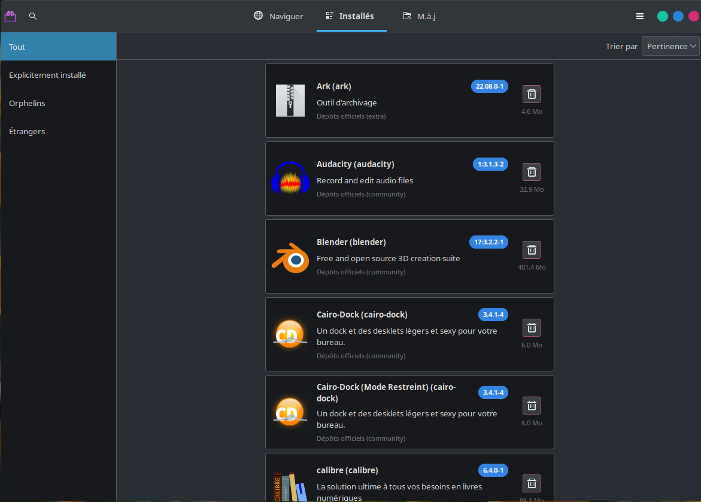
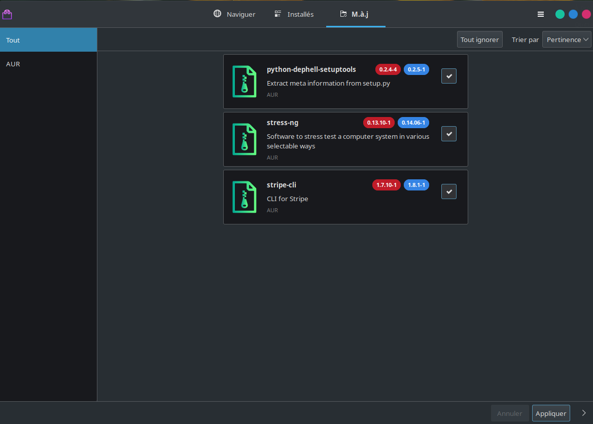

# Pamac

## Introduction
Développé depuis 7 ans par le Français Guillaume Benoît en Vala et GTK3 pour l'interface graphique, [**Pamac**](https://gitlab.manjaro.org/applications/pamac/) est un outil propre à **Manjaro**. Non seulement il permet
d'installer, de les supprimer, de mettre à jour le système et les applications déjà installées, mais il permet aussi de faire la même chose pour **AUR**,
les **appimages**, les **flatpak** et les **snaps**. Il se base sur la bibliothèque d'Archlinux : libalpm.

Pour être plus précis, il s'agit d'un ensemble d'outils, à savoir:
- un outil en CLI
- une interface graphique en GTK3 : **pamac-manager**
- une icône dans le systray avec notification de maj : **pamac-tray**
- un AppIndicator avec notification de maj : **pamac-appindicator-tray**
- une extension gnome-shell : **pamac updates indicator**

## Pamac GUI
L'interface est à mi-chemin entre un App Store et un Octopi. 

A gauche, un bandeau précise la provenance des paquets (officiels, AUR, ...) et leur état (installés, orphelins, étrangers).
Nous avons ensuite une partie centrale avec 3 onglets : Naviguer, Installer et MAJ.
Sans entrer dans les détails tant leurs noms sont explicites, nous pouvons nous aider aussi d'une barre de recherche tout à 
gauche afin de pouvoir localiser un logiciel en particulier. 

L'onglet Installer

L'onglet Maj avec 3 maj à faire

## Preférences
Lors du 1er lancement de l'interface, il faut d'abord faire un tour dans les Préférences afin d'activer de nombreux paramètres 
dont notamment le support pour AUR mais pas que. Elle se décompose en trois onglets : **Général**, **Avancé** et **Tierces parties**.

### Général
On a accès à trois sous-catégories. 
- Les MAJ avec la possibilité de les vérifier ainsi que leurs fréquences. On peut aussi masquer l'icône s'il n'y a aucune maj.
- On peut spécifier le nombre de téléchargements parallèles fixés à 4 par default
- Enfin, on choisit parmi les miroirs officiels : Allemagne par défaut 

### Avançé
Ici, on a deux sous-catégories :
- On configure le bon fonctionnement du système en évitant notamment la catastrophe s'il n'y a pas assez de place disponible pour une maj.
- On peut ignorer des maj.

### Tierces parties
Enfin, on a trois sous-catégories qui offrent l'immense possibilité d'êtendre drastiquement le nombre de logiciels disponibles :
- La prise en charge des paquets provenant d' **AUR** avec la possibilité de paramétrer plus finement le comportement vis à vis de ce dépôt hors-norme.
- La prise en charge des **Flatpak**
- La prise en charge des **Snap**

## Pour conclure
**Pamac** est un bon logiciel cependant il souffre, par experience, de certains problèmes pour désinstaller
proprement un logiciel. Certaines traces persistent et il vaut mieux le faire en CLI soit avec pacman, soit avec Yay pour les 
paquets provenant d'AUR. Certes, quelquefois il bugue, mais la communauté est active et il évolue rapidement. Sans parler, 
que seul un développeur permet à ce projet d'exister. Et comme le bon vin, il ne cesse de s'améliorer au fil du temps de version
en version.